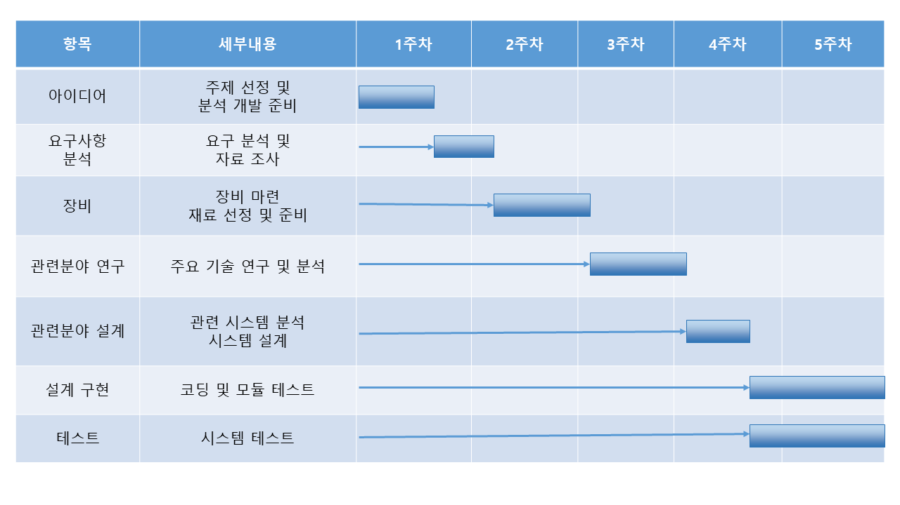
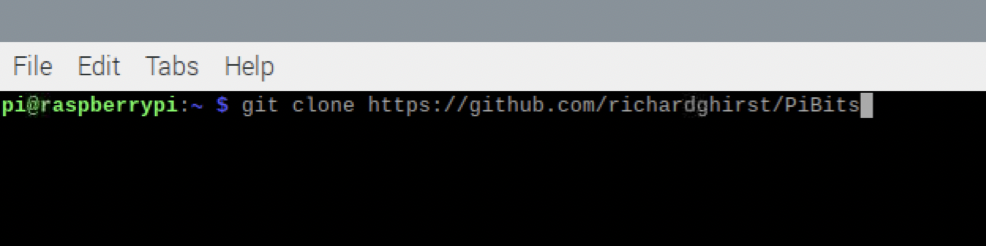
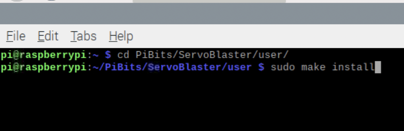
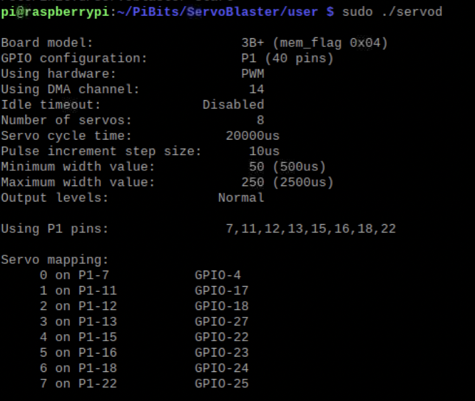

# 무선네트워크 프로젝트 <스마트 자동 배식기>

### * **프로젝트 참여자**
    201744005 김경은
    201744020 박지석
    201644034 정우영

1. 프로젝트 개요
    * 개발 배경/목표
    * 주요 기능
    * 설계
2. 개발 준비
    * 제작 재료 목록
    * 개발 일정
3. 개발 과정
    * 개발 환경
    * 구현 과정
4. 개발 결과
    * 결과 화면
    * 개선 방향

# 1. 프로젝트 개요
- ### 스마트 자동 배식기란?
    - 어플을 이용해 사료 배급이 가능하고 카메라를 통해 실시간으로 반려동물을 확인할 수 있는 화면으로 이루어진 애플리케이션 

- ### 개발 배경
    - 어린 강아지 같은 경우 항상 일정한 시간에 개월 수에 따라 급식해야하는 사료랑이 다른데 이를 스마트 자동 급식기를 사용하면 밖에서도 편리하게 관리 가능
    - 최근 반려동물을 기르는 1인 가구가 증가함에 따라 약속, 야근등과 같은 반려동물이 불가피하게 혼자 있어야 할 상황에 대비하기 위해

- ### 목표
    - 원격지원을 통한 다양한 반려동물 케어 서비스 제공

- ### 주요 기능
    - 앱 내부의 버튼을 통한 사료 배식 기능
    - 앱 내부의 화면을 통한 실시간 반려동물 확인 및 관리 기능
   
- ### 설계
     
***
 
  
# 2. 개발 준비

- ### 제작재료
    | 재료 | 구매주소 | 수량 | 가격대 |
    |---|---|---|---|
    | 라즈베리파이 | 실습용 | 1 | 실습용 |
    | L298N 모터 | 실습용 | 1 | 실습용 | 
    | DC 모터 | 실습용 | 1 | 실습용 |
    | 캠 | 실습용 | 1 | 실습용 |
    | 급식기 | https://url.kr/w3laor | 1 | 17,400 |

- ### 개발 일정
    | 항목 | 세부내용 및 개발 항목 | 개발자 | 시작일 | 종료일 |
    |---|---|---|---|---|
    | 아이디어 | 주제 선정 및 분석 개발 준비 | 김경은 | 11/8 | 11/11 |
    | 요구사항 분석 | 요구 분석 및 자료 조사 | 팀 전원 | 11/12 | 11/15 |
    | 장비 | 장비 마련, 재료 선정 및 준비 | 팀 전원 | 11/16 | 11/22 |
    | 관련분야 연구 | 주요 기술 연구 및 분석 | 팀 전원 | 11/23 | 11/28 |
    | 관련분야 설계 | 관련 시스템 분석, 시스템 설계 | 김경은 | 11/29 | 12/2 |
    | 설계 구현 | 코딩 및 모듈 테스트 | 박지석, 정우영 | 12/3 | 12/9 |
    | 테스트 | 시스템 테스트 | 팀 전원 | 12/3 | 12/9 | 4-5
    
 - ### 간트 차트
     
***
    
# 3. 개발 과정
- ### 개발 환경
    - Raspbian: 라즈베리파이에 최적화, Xwindow를 사용할 수 있는 OS  
    - VNC Viewer: 라즈베리를 원격으로 다루기 위해 사용하는 원격 데스크톱 클라이언트
    - GitHub: 소프트웨어 개발 프로젝트를 위한 소스코드 관리서비스, 버전 관리를 위해 사용
    - AndroidStudio: 안드로이드 전용 어플(앱) 제작을 위한 통합 개발 환경(IDE) 
- ### 구현 과정
1.### ServoBlaster 설치
    
2.### ServoBlaster 데몬 실행
    
3.### ServoBlaster 정보

***

# 4. 개발 결과
- ### 결과 화면
    * **사료배급 기능** 
       
    * **CCTV 기능** 
         
       
- #### 개선 방향
